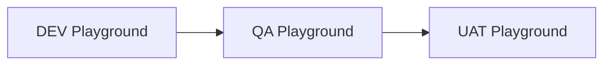

# 🚀 DevOpsProject – Salesforce DevOps & Integrações com Playgrounds

Este projeto é uma simulação de um pipeline completo de DevOps no Salesforce com foco em **controle de mudanças**, **automação de deploys** e **integrações externas**, tudo utilizando apenas **Trailhead Playgrounds**.

---

## 💡 Visão Geral

O **DevOpsProject** demonstra como seria possível gerenciar e automatizar o ciclo de vida de uma mudança no Salesforce, desde o ambiente de desenvolvimento (DEV), passando por testes (QA), até chegar na validação final (UAT), com deploys automáticos controlados por branches no GitHub.

---

## 🧱 Funcionalidades Principais

- ✅ **Objeto personalizado** `ChangeRequest__c` para simular gerenciamento de mudanças
- ✅ **API REST em Apex** para leitura e criação de requisições
- ✅ **Integração externa via chamada HTTP com API pública**
- ✅ **Deploy automatizado com GitHub Actions** entre orgs DEV → QA → UAT
- ✅ **Ambientes protegidos** por esteira (não é possível subir de DEV direto para UAT)

---

## 🧭 Pipeline (Esteira de Ambientes)



| Origem     | Destino permitido |
|------------|-------------------|
| DEV        | QA ✅             |
| QA         | UAT ✅            |
| DEV → UAT  | ❌                |
| QA → DEV   | ❌                |
| UAT → DEV  | ❌                |
| UAT → QA   | ❌                |

Deploys são controlados via **branches**:

- QA
- UAT

---

## 🔧 Como rodar localmente

### 1. Pré-requisitos

- ✅ Conta no [Trailhead](https://trailhead.salesforce.com/)
- ✅ VS Code com [Salesforce Extension Pack](https://marketplace.visualstudio.com/items?itemName=salesforce.salesforcedx-vscode)
- ✅ [Salesforce CLI (SFDX)](https://developer.salesforce.com/tools/sfdxcli)
- ✅ Conta no [GitHub](https://github.com/)

### 2. Clone o projeto

```bash
git clone https://github.com/seu-usuario/DevOpsProject.git
cd DevOpsProject
```

### 3. Conecte os Playgrounds

```bash
sfdx auth:web:login -a DevOrg
sfdx auth:web:login -a QAOrg
sfdx auth:web:login -a UATOrg
```

### 4. Envie o projeto para o ambiente DEV

```bash
sfdx force:source:deploy -p force-app -u DevOrg
```

---

## ⚙️ GitHub Actions (CI/CD)

O projeto possui duas automações:

- 📁 `.github/workflows/dev-to-qa.yml` → Deploy de Dev para QA
- 📁 `.github/workflows/qa-to-uat.yml` → Deploy de QA para UAT

### 🔐 Como configurar

Adicione os secrets no GitHub:

- `SFDX_AUTH_URL_QA` → Auth URL de QA
- `SFDX_AUTH_URL_UAT` → Auth URL de UAT

Você pode gerar com:

```bash
sfdx force:org:display -u QAOrg --verbose
```

Copie a linha que começa com `Sfdx Auth Url`.

---

## 🌐 Integração com API Externa

O projeto inclui uma chamada HTTP em Apex para a [JSONPlaceholder API](https://jsonplaceholder.typicode.com/) como exemplo de integração externa.

```apex
HttpRequest req = new HttpRequest();
req.setEndpoint('https://jsonplaceholder.typicode.com/posts/1');
req.setMethod('GET');
```

---

## 🧪 Testes

Todas as classes Apex estão acompanhadas de testes de unidade (`*_Test.cls`) para garantir cobertura mínima de 75%.

Execute:

```bash
sfdx force:apex:test:run -u DevOrg --resultformat human
```

---

## ✨ Diferenciais Técnicos

- Integrações REST internas e externas
- Esteira de deploy multi-org com controle por branch
- CI/CD com GitHub Actions e autenticação via `sfdxurl`
- Uso exclusivo de recursos **gratuitos** (Trailhead, GitHub, VS Code)

---

## 👩‍💻 Desenvolvido por

**Yas Brand**  
💼 Salesforce DevOps & Integration Enthusiast  
📫 [linkedin.com/in/yasminbrandao-ibm-salesforce](https://linkedin.com/in/yasminbrandao-ibm-salesforce)

---

## 📜 Licença

Este projeto é livre para uso educacional e profissional como portfólio.
